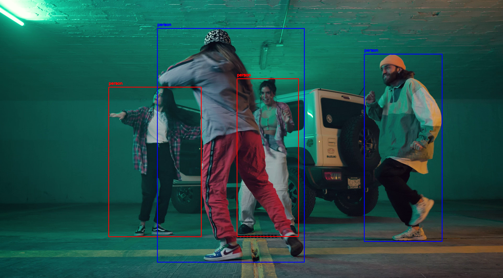
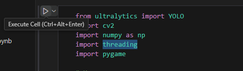

# Closeness Detector

Этот проект использует модель YOLO для определения, находятся ли люди слишком близко друг к другу. <br />
Если люди стоят рядом с друг другом, программа обведет их красной рамкой и издаст сигнал тревоги (звонок). Иначе люди будут обведены синей рамкой.
---

## Пример работы

Два человека находятся рядом:

Все находятся больше заданного расстояния друг от друга:

Человек спереди не мешает определить расстояние между людьми:


---

## Установка и запуск

Следуйте этим шагам, чтобы настроить и запустить проект:

### 1. Установите Visual Studio
Убедитесь, что у вас установлена Visual Studio с поддержкой Python.

### 2. Скачайте нужные библиотеки
Откройте терминал в папке проекта и установите необходимые библиотеки. Как это сделать:
- Откройте Visual Studio.
- В левом верхнем углу найдите Terminal -> New Terminal.

- В появившемся окне найдите "галочку", нажмите на нее и выберите Command Prompt  

- В терминале впишите следующие команды:
```bash
pip install threading
pip install ultralytics
pip install opencv-python
pip install pygame
pip install numpy
```
### 3. Запустите проект


