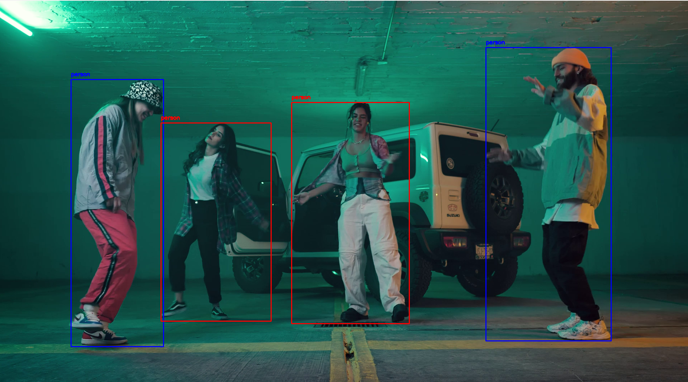
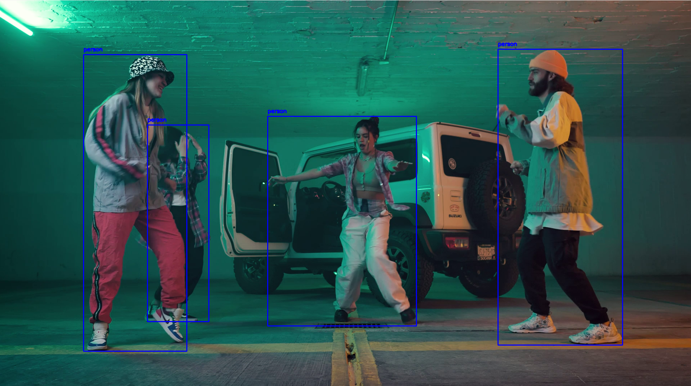
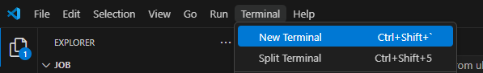
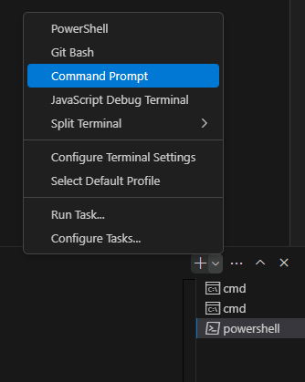

# Closeness Detector

Этот проект использует модель YOLO для определения, находятся ли люди слишком близко друг к другу.

---

## Пример работы




---

## Установка и запуск

Следуйте этим шагам, чтобы настроить и запустить проект:

### 1. Установите Visual Studio
Убедитесь, что у вас установлена Visual Studio с поддержкой Python.

### 2. Скачайте нужные библиотеки
Откройте терминал в папке проекта и установите необходимые библиотеки. Как это сделать:
1) Откройте Visual Studio.
2) В правом верхнем углу найдите Terminal -> New Terminal.
3) В появившемся окне найдите "галочку", нажмите на нее и выберите Command Prompt  


4) В терминале впишите следующие команды:
5) 

```pip install threading
```pip install ultralytics
```pip install opencv-python
```pip install pygame
```pip install numpy
